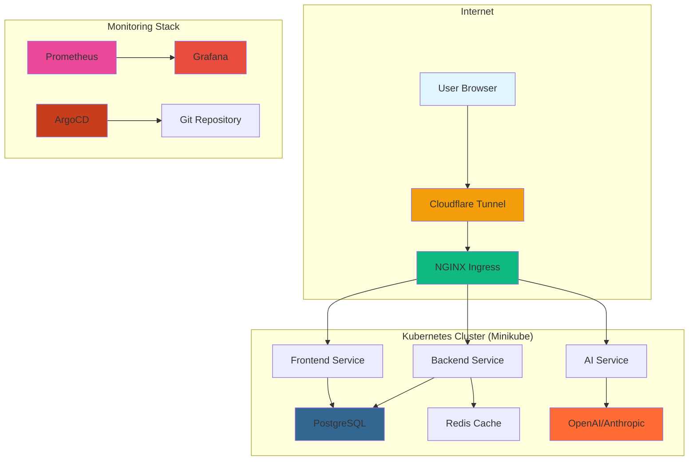
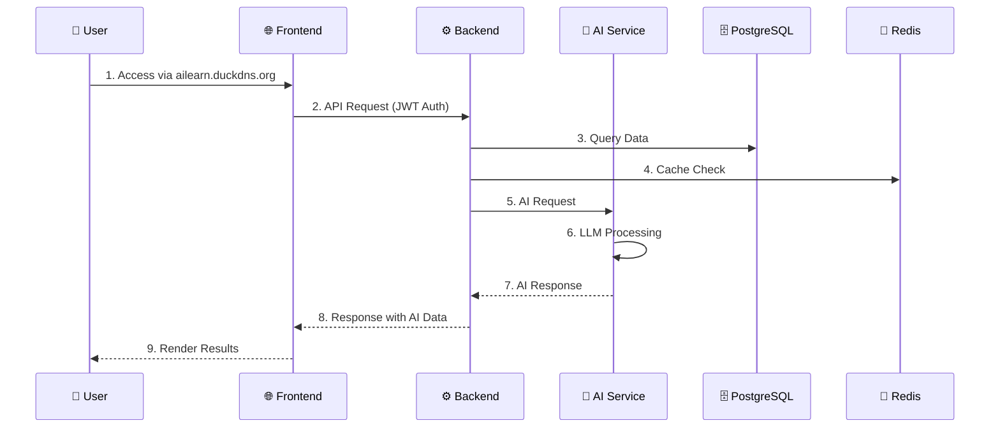
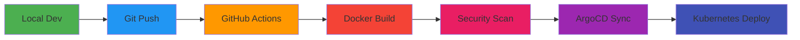
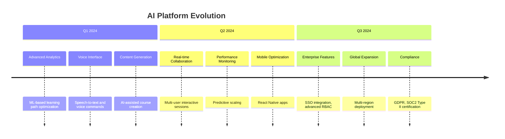

# 🧠 AI Smart Learning Platform — Production-Grade Kubernetes SaaS

> **Cloud-native, multi-tenant AI-powered learning platform** supporting **10,000+ concurrent users** with **multilingual AI** (English + Mongolian), built for **enterprise scale** and **FAANG-level engineering standards**.

---

## 🚀 Overview

### What It Does
- **🎓 AI-Powered Learning**: Adaptive learning paths with personalized recommendations using GPT-4, Claude, and local LLMs
- **🌍 Multilingual Support**: Full English + Mongolian (Монгол) localization with intelligent language detection
- **👥 Multi-Tenant Architecture**: Enterprise-grade isolation with role-based access control (RBAC)
- **📊 Real-time Analytics**: Comprehensive learning analytics with Prometheus + Grafana observability
- **🔄 GitOps Automation**: Full CI/CD pipeline with ArgoCD for zero-downtime deployments

### Why This Architecture
- **☁️ Cloud-Native**: Built for Kubernetes with horizontal auto-scaling and self-healing
- **🚀 Microservices**: Decoupled services for independent scaling and deployment
- **🔒 Security-First**: JWT authentication, rate limiting, and container security best practices
- **📈 Production-Ready**: Monitoring, alerting, and observability built-in
- **🌐 Global Access**: Cloudflare Tunnel for seamless external domain access

---

## 🏗️ System Architecture

### Microservices Design


### Data Flow Architecture


---

## 🔄 DevOps Workflow

### Developer Experience


### GitOps Pipeline
```mermaid
gitGraph
    commit id: "feat: new AI recommendation engine"
    branch main
    checkout main
    cherry-pick id: "fix: resolve database connection"
    
    commit id: "chore: update dependencies"
    checkout develop
    merge develop
    
    commit id: "ci: add security scanning"
    checkout main
    merge main tag: "v1.2.0"
```

---

## 📦 Kubernetes Architecture

### Namespace Strategy
```yaml
# eduai namespace isolation
apiVersion: v1
kind: Namespace
metadata:
  name: eduai
  labels:
    environment: production
    project: ai-smart-learning
    managed-by: devops-smart
```

### Deployment Configuration
```yaml
# Frontend Deployment (React + Nginx)
apiVersion: apps/v1
kind: Deployment
metadata:
  name: frontend
  namespace: eduai
spec:
  replicas: 2
  strategy:
    type: RollingUpdate
    rollingUpdate:
      maxSurge: 1
      maxUnavailable: 0
  template:
    spec:
      containers:
      - name: frontend
        image: eduai-frontend:latest
        ports:
        - containerPort: 80
        resources:
          requests:
            memory: "128Mi"
            cpu: "100m"
          limits:
            memory: "256Mi"
            cpu: "200m"
        livenessProbe:
          httpGet:
            path: /
            port: 80
          initialDelaySeconds: 60
          periodSeconds: 15
        readinessProbe:
          httpGet:
            path: /
            port: 80
          initialDelaySeconds: 30
          periodSeconds: 10
```

### Service Architecture
```yaml
# NodePort for WSL2 external access
apiVersion: v1
kind: Service
metadata:
  name: frontend
  namespace: eduai
spec:
  type: NodePort
  selector:
    app: frontend
  ports:
    - port: 3000
      targetPort: 80
      nodePort: 30007
```

### Ingress Configuration
```yaml
# Internal routing with NGINX
apiVersion: networking.k8s.io/v1
kind: Ingress
metadata:
  name: eduai-ingress
  namespace: eduai
spec:
  rules:
  - host: ailearn.duckdns.org
    http:
      paths:
      - path: /
        pathType: Prefix
        backend:
          service:
            name: frontend
            port:
              number: 3000
```

---

## 🐳 Docker Strategy

### Multi-Stage Frontend Build
```dockerfile
# Stage 1: Builder
FROM node:20-alpine as builder
WORKDIR /app
COPY package*.json ./
RUN npm ci --only=production
COPY . .
RUN npm run build

# Stage 2: Production
FROM nginx:1.25-alpine as production
COPY --from=builder /app/dist /usr/share/nginx/html
COPY nginx.conf /etc/nginx/conf.d/default.conf
EXPOSE 80
CMD ["nginx", "-g", "daemon off;"]
```

### Optimized Backend Build
```dockerfile
FROM node:20-alpine
WORKDIR /app

# Security: Non-root user
RUN addgroup -g 1001 -S nodejs && \
    adduser -S -D -H -u 1001 -h /app -s /sbin/nologin -G nodejs nodejs

USER nodejs
COPY package*.json ./
RUN npm ci --only=production && npm cache clean --force
COPY --chown=nodejs:nodejs . .
EXPOSE 5000
CMD ["dumb-init", "node", "server.js"]
```

---

## 🌐 Networking & Domain

### WSL2 Architecture Explained

```mermaid
graph TB
    subgraph "Host Machine (Windows)"
        A[WSL2] --> B[Ubuntu 24.04]
        B --> C[Docker Desktop]
        C --> D[Minikube]
    end
    
    subgraph "Network Isolation"
        E[localhost:3000] --> F[NodePort 30007]
        F --> G[192.168.49.2:30007]
    end
    
    subgraph "External Access Solution"
        H[Cloudflare Tunnel] --> I[ailearn.duckdns.org]
        I --> J[Frontend Service]
        J --> K[localhost:3000]
    end
    
    style A fill:#0078d7
    style B fill:#28a745
    style C fill:#24b92e
    style D fill:#0db7ed
    style H fill:#f68212
    style I fill:#f59e0b
```


### Why NodePort Fails Externally
- **WSL2 Network Isolation**: Minikube runs in WSL2 with separate network namespace
- **Windows Host Access**: `192.168.49.2:30007` only accessible from within WSL2
- **Port Forwarding Required**: `kubectl port-forward` needed for localhost access
- **Firewall Limitations**: Windows Defender blocks direct NodePort access

### Cloudflare Tunnel Solution
```bash
# Automated domain tunnel setup
cloudflared tunnel run eduai-tunnel \
  --config ~/.cloudflared/config.yml

# Routes external domain to internal service
ingress:
  - hostname: ailearn.duckdns.org
    service: http://localhost:3000
  - service: http_status:404
```

---

## ⚙️ Setup & Installation

### Prerequisites
```bash
# Check system requirements
command -v docker >/dev/null || echo "❌ Docker required"
command -v minikube >/dev/null || echo "❌ Minikube required"
command -v kubectl >/dev/null || echo "❌ kubectl required"
command -v git >/dev/null || echo "❌ Git required"
```

### Quick Start (5 Minutes)
```bash
# 1. Clone Repository
git clone https://github.com/bayarmaa01/ai-smart-learning-platform.git
cd ai-smart-learning-platform

# 2. Start Platform (Automated)
./devops-smart.sh --full --force-build

# 3. Access Application
echo "🌐 Public URL: https://ailearn.duckdns.org"
echo "📱 Local: http://localhost:3000 (with --forward)"
echo "🔐 Admin: admin/admin123"
```

### Advanced Setup Options
```bash
# Development mode (fast restarts)
./devops-smart.sh --fast --forward

# Production deployment with tunnel
./devops-smart.sh --full --force-build

# Reset everything (clean slate)
./devops-smart.sh --reset

# System status check
./devops-smart.sh --status
```

---

## 🧪 Debugging & Troubleshooting

### Common Issues & Solutions

#### PostgreSQL Connection Issues
```bash
# Problem: Backend CrashLoopBackOff
kubectl logs deployment/backend -n eduai | grep "ECONNREFUSED"

# Solution: Check PostgreSQL status
kubectl get pods -n eduai -l app=postgres
kubectl describe pod -n eduai -l app=postgres

# Fix: Restart PostgreSQL
kubectl rollout restart deployment/postgres -n eduai
```

#### Frontend Pod Issues
```bash
# Problem: Frontend not ready
kubectl get pods -n eduai -l app=frontend

# Check pod events
kubectl describe pod -n eduai -l app=frontend

# Fix: Check image and resources
kubectl get events -n eduai --sort-by='.lastTimestamp'
```

#### Essential kubectl Commands
```bash
# Real-time pod monitoring
watch kubectl get pods -n eduai

# Detailed pod information
kubectl describe pod <pod-name> -n eduai

# Service connectivity test
kubectl exec -it <pod-name> -n eduai -- /bin/sh

# Log streaming
kubectl logs -f <pod-name> -n eduai

# Port forwarding for debugging
kubectl port-forward svc/frontend 3000:3000 -n eduai
```

#### Error Resolution Matrix
| Error | Cause | Solution |
|--------|--------|----------|
| `ImagePullBackOff` | Image not built | `./devops-smart.sh --force-build` |
| `CrashLoopBackOff` | Config/DB issue | Check logs, fix env vars |
| `Pending` | Resource limits | Increase memory/CPU |
| `NodePort conflict` | Port already used | Change NodePort in deployment |

---

## 📊 Monitoring & Observability

### Prometheus Metrics Dashboard
```bash
# Key metrics to monitor
# 1. Application Performance
container_cpu_usage_seconds_total{container="backend"}
container_memory_working_set_bytes{container="frontend"}
http_requests_total{method="GET",status="200"}

# 2. Infrastructure Health
up{job="kubernetes-apiservers"}
kube_pod_status_phase{phase="Running"}
node_memory_MemAvailable_bytes

# 3. Business Metrics
active_users_total
course_enrollments_total
ai_recommendations_served_total
```

### Grafana Dashboard Setup
```json
{
  "dashboard": {
    "title": "AI Learning Platform Overview",
    "panels": [
      {
        "title": "Active Users",
        "type": "stat",
        "targets": [
          {
            "expr": "sum(active_users_total)",
            "legendFormat": "Total Active"
          }
        ]
      },
      {
        "title": "AI Response Time",
        "type": "graph",
        "targets": [
          {
            "expr": "histogram_quantile(0.95, rate(ai_response_duration_seconds_bucket[5m]))",
            "legendFormat": "95th percentile"
          }
        ]
      }
    ]
  }
}
```

### Why Observability Matters
- **🚨 Proactive Detection**: Identify issues before users notice
- **📈 Performance Optimization**: Data-driven scaling decisions
- **🔍 Root Cause Analysis**: Deep dive into system behavior
- **💰 Cost Optimization**: Resource utilization monitoring
- **📋 SLA Compliance**: Meet uptime and performance guarantees

---

## 🔐 Security Considerations

### Container Security
```yaml
# Security context for all pods
securityContext:
  runAsNonRoot: true
  runAsUser: 1001
  runAsGroup: 1001
  fsGroup: 1001
  allowPrivilegeEscalation: false
  readOnlyRootFilesystem: false
  capabilities:
    drop:
      - ALL
```

### Network Security
```yaml
# Network policies
apiVersion: networking.k8s.io/v1
kind: NetworkPolicy
metadata:
  name: eduai-network-policy
  namespace: eduai
spec:
  podSelector: {}
  policyTypes:
  - Ingress
  - Egress
  ingress:
  - from:
    - namespaceSelector:
        matchLabels:
          name: ingress-nginx
  egress:
  - to:
    - namespaceSelector:
        matchLabels:
          name: eduai
```

### Environment Variable Security
```bash
# Never commit secrets to git
# Use Kubernetes secrets instead
kubectl create secret generic eduai-secrets \
  --from-literal=DATABASE_URL="postgresql://..." \
  --from-literal=JWT_SECRET="your-256-bit-secret" \
  --from-literal=OPENAI_API_KEY="sk-..." \
  -n eduai

# Reference in deployments
env:
  - name: DATABASE_URL
    valueFrom:
      secretKeyRef:
        name: eduai-secrets
        key: DATABASE_URL
```

### Future Security Enhancements
- **🔑 RBAC**: Role-based access control with fine-grained permissions
- **🛡️ Service Mesh**: Istio for mTLS and traffic management
- **🔒 Secrets Management**: External secret stores (HashiCorp Vault)
- **🚨 Image Scanning**: Trivy integration in CI/CD pipeline
- **📊 Security Monitoring**: Falco for runtime threat detection

---

## 🚀 Production Readiness

### Cloud Migration Requirements
```yaml
# AWS EKS Transformation
apiVersion: eksctl.k8s.io/v1alpha5
kind: ClusterConfig
metadata:
  name: eduai-prod
  region: us-east-1
  version: "1.30"
managedNodeGroups:
  - name: eduai-nodes
    instanceType: m5.large
    minSize: 3
    maxSize: 10
    desiredCapacity: 5
    volumeType: gp3
    ssh:
      allow: true
    iam:
      withOIDC: true
addons:
  - name: vpc-cni
  - name: coredns
  - name: aws-ebs-csi-driver
```

### Load Balancer Configuration
```yaml
# Replace NodePort with LoadBalancer
apiVersion: v1
kind: Service
metadata:
  name: frontend-lb
  annotations:
    service.beta.kubernetes.io/aws-load-balancer-type: "nlb"
    service.beta.kubernetes.io/aws-load-balancer-scheme: "internet-facing"
spec:
  type: LoadBalancer
  selector:
    app: frontend
  ports:
    - port: 443
      targetPort: 80
      protocol: TCP
```

### Production CI/CD Enhancements
```yaml
# GitHub Actions for production
name: Deploy to Production
on:
  push:
    branches: [main]
jobs:
  deploy:
    runs-on: ubuntu-latest
    steps:
      - uses: actions/checkout@v4
      - name: Setup kubectl
        uses: azure/setup-kubectl@v3
      - name: Deploy to EKS
        run: |
          kubectl set image deployment/frontend frontend:${{ github.sha }} -n eduai
          kubectl rollout status deployment/frontend -n eduai
```

---

## 📁 Project Structure

```
ai-smart-learning-platform/
├── 📱 frontend/                    # React.js SPA Application
│   ├── src/
│   │   ├── components/          # Reusable UI components
│   │   ├── pages/              # Route-based page components
│   │   ├── store/              # Redux Toolkit state management
│   │   ├── services/           # API service layer
│   │   ├── i18n/               # EN + MN translations
│   │   └── layouts/            # Page layout components
│   ├── Dockerfile               # Multi-stage build
│   └── nginx.conf               # Production web server config
│
├── ⚙️ backend/                     # Node.js Express API
│   ├── src/
│   │   ├── controllers/        # Route handlers and business logic
│   │   ├── middleware/         # Auth, validation, rate limiting
│   │   ├── routes/             # Express router configuration
│   │   ├── db/                 # PostgreSQL connection and models
│   │   ├── cache/              # Redis client and caching
│   │   ├── monitoring/         # Prometheus metrics
│   │   └── websocket/          # Real-time communication
│   └── Dockerfile               # Security-hardened container
│
├── 🤖 ai-service/                  # Python FastAPI AI Service
│   ├── app/
│   │   ├── routers/            # API endpoint definitions
│   │   ├── services/           # LLM integration and AI logic
│   │   └── core/               # Configuration and utilities
│   └── Dockerfile               # Python container with security
│
├── ☸️ k8s/                          # Kubernetes manifests
│   ├── namespace.yaml             # Namespace isolation
│   ├── configmap.yaml            # Configuration management
│   ├── secrets.yaml              # Secret management
│   ├── postgres-deployment.yaml  # Database deployment
│   ├── backend-deployment.yaml   # API service deployment
│   ├── frontend-deployment.yaml  # Web application deployment
│   └── ingress.yaml              # External access routing
│
├── 📊 helm/eduai/                   # Helm chart for production
│   ├── Chart.yaml                # Chart metadata
│   ├── values.yaml              # Environment-specific values
│   └── templates/               # Kubernetes templates
│
├── 🚀 devops-smart.sh               # Intelligent deployment script
├── 📋 docker-compose.yml             # Local development setup
├── 📈 monitoring/                  # Prometheus + Grafana configs
├── 🔧 ansible/                     # Server configuration playbooks
└── 📚 README.md                     # This documentation
```

---

## 🎯 Future Enhancements

### AI Feature Roadmap


### Infrastructure Evolution
```yaml
# Horizontal Pod Autoscaler
apiVersion: autoscaling/v2
kind: HorizontalPodAutoscaler
metadata:
  name: backend-hpa
  namespace: eduai
spec:
  scaleTargetRef:
    apiVersion: apps/v1
    kind: Deployment
    name: backend
  minReplicas: 2
  maxReplicas: 20
  metrics:
    - type: Resource
    resource:
      name: cpu
      target:
        type: Utilization
        averageUtilization: 70
  behavior:
    scaleDown:
      stabilizationWindowSeconds: 300
      policies:
      - type: Percent
        value: 10
    scaleUp:
      stabilizationWindowSeconds: 60
      policies:
      - type: Percent
        value: 100
```

### Advanced Helm Chart Structure
```
helm/eduai/
├── Chart.yaml                 # Chart metadata and dependencies
├── values.yaml               # Default configuration values
├── values-production.yaml    # Production overrides
├── values-staging.yaml       # Staging environment
└── templates/
    ├── deployment.yaml        # Application deployments
    ├── service.yaml          # Service definitions
    ├── ingress.yaml          # External access
    ├── configmap.yaml       # Configuration
    ├── secret.yaml           # Secret management
    ├── hpa.yaml            # Auto-scaling
    ├── pdb.yaml             # Pod disruption budgets
    └── serviceaccount.yaml   # Service accounts and RBAC
```

---

## 🏆 Demo & Testing

### Quick Demo Setup
```bash
# 1. Start Platform
./devops-smart.sh --full --force-build

# 2. Wait for Ready State
watch kubectl get pods -n eduai

# 3. Access Demo
echo "🌐 Demo URL: https://ailearn.duckdns.org"
echo "👤 Student Login: student@demo.com / Demo@1234"
echo "👨‍💼 Admin Login: admin@demo.com / Admin@1234"
```

### Load Testing
```bash
# Performance testing with k6
k6 run --vus 100 --duration 5m load-test.js

# Database performance testing
pgbench -h localhost -p 5432 -U postgres -d eduai -c 10 -j 100

# AI service stress testing
hey -n 1000 -c 10 -m POST -d '{"message":"test"}' \
  http://localhost:8000/api/v1/ai/chat
```

---

## 📞 Support & Community

### Getting Help
- **📖 Documentation**: Comprehensive guides in `/docs` directory
- **🐛 Issue Reporting**: [GitHub Issues](https://github.com/bayarmaa01/ai-smart-learning-platform/issues)
- **💬 Discussions**: [GitHub Discussions](https://github.com/bayarmaa01/ai-smart-learning-platform/discussions)
- **📧 Contributing**: See [CONTRIBUTING.md](CONTRIBUTING.md) for development guidelines

### Community Resources
- **🎓 Learning Path**: Step-by-step tutorials for platform features
- **🔧 Development Setup**: Local development environment configuration
- **🚀 Deployment Guides**: Production deployment best practices
- **📊 Monitoring**: Alerting and observability setup guides

---

## 📄 License

**MIT License** - See [LICENSE](LICENSE) for full terms.

### What You Can Do
- ✅ Commercial use
- ✅ Modification and distribution
- ✅ Private use
- ✅ Patent use

### Attribution
```
AI Smart Learning Platform
Copyright (c) 2024 [Your Name]

This software is licensed under the MIT License.
See https://opensource.org/licenses/MIT for more information.
```

---

## 🚀 Quick Start Summary

```bash
# One-command deployment
git clone https://github.com/bayarmaa01/ai-smart-learning-platform.git
cd ai-smart-learning-platform
./devops-smart.sh --full --force-build --forward

# 🎉 Your AI Learning Platform is now running!
# 🌐 Access: https://ailearn.duckdns.org
# 📱 Local: http://localhost:3000
# 🔐 Credentials: admin/admin123
```

---

**Built with ❤️ for the future of AI-powered education** 🧠✨
