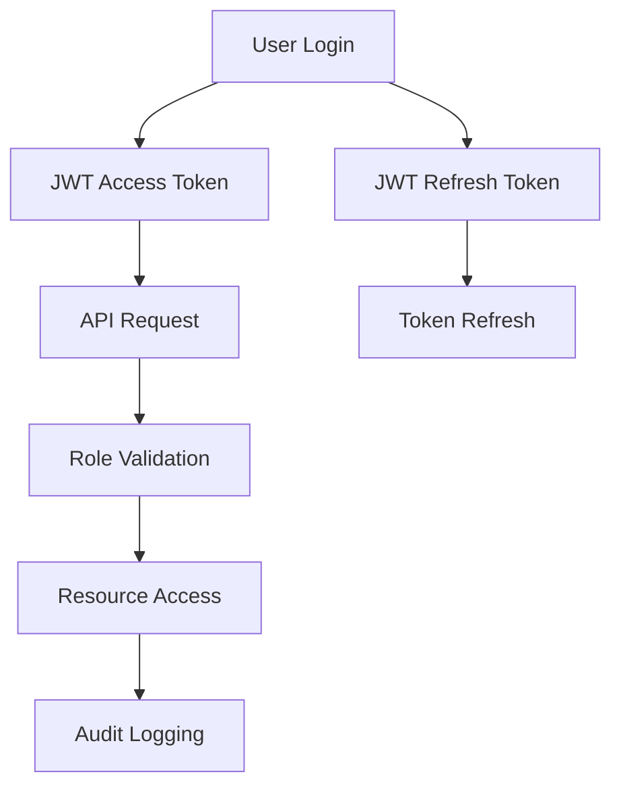

# EduAI Platform - Architecture Documentation

## Table of Contents
- [System Overview](#system-overview)
- [Architecture Principles](#architecture-principles)
- [Component Architecture](#component-architecture)
- [Data Architecture](#data-architecture)
- [Security Architecture](#security-architecture)
- [Scalability Architecture](#scalability-architecture)
- [Multi-Tenancy](#multi-tenancy)
- [Technology Stack](#technology-stack)
- [Design Patterns](#design-patterns)
- [Performance Considerations](#performance-considerations)

---

## System Overview

EduAI Platform is a cloud-native, microservices-based learning management system designed to support **10,000+ concurrent users** with **multilingual AI capabilities**.

### High-Level Architecture

```
┌─────────────────────────────────────────────────────────────────┐
│                        CDN / Edge Layer                         │
│                    (CloudFront / Fastly)                        │
└─────────────────────────┬───────────────────────────────────────┘
                          │
┌─────────────────────────▼───────────────────────────────────────┐
│                  Load Balancer / Ingress                        │
│              (NGINX Ingress Controller + TLS)                  │
└──────┬──────────────────┬──────────────────────┬───────────────┘
       │                  │                      │
┌──────▼──────┐  ┌────────▼────────┐  ┌─────────▼──────────┐
│  Frontend   │  │  Backend API    │  │   AI Microservice  │
│  (React)    │  │  (Node.js)      │  │   (Python)         │
│  SPA + SSR  │  │  REST + GraphQL │  │   FastAPI          │
│  i18n EN/MN │  │  JWT + RBAC     │  │   Multilingual     │
│  PWA Ready  │  │  Rate Limiting  │  │   LLM Integration  │
└─────────────┘  └────────┬────────┘  └────────────────────┘
                          │
          ┌───────────────┼───────────────┐
          │               │               │
   ┌──────▼──────┐ ┌──────▼──────┐ ┌─────▼──────┐
   │ PostgreSQL  │ │   Redis     │ │    S3/     │
   │  (Primary + │ │   Cache     │ │   MinIO    │
   │   Replica)  │ │   Sessions  │ │   Storage  │
   │   HA Setup  │ │   Pub/Sub   │ │   CDN      │
   └─────────────┘ └─────────────┘ └────────────┘
```

---

## Architecture Principles

### 1. **Cloud-Native Design**
- Containerized microservices
- Kubernetes orchestration
- Horizontal scaling
- Self-healing capabilities

### 2. **Multi-Tenancy**
- Data isolation per tenant
- Tenant-specific configurations
- Resource quotas per tenant
- Custom branding support

### 3. **Security-First**
- Zero-trust network
- Defense in depth
- Encryption at rest and in transit
- Regular security audits

### 4. **High Availability**
- No single points of failure
- Active-active deployments
- Geographic distribution
- Automated failover

### 5. **Performance Optimization**
- Caching at multiple layers
- CDN for static assets
- Database query optimization
- Asynchronous processing

---

## Component Architecture

### Frontend Layer

```typescript
// Frontend Architecture
frontend/
├── src/
│   ├── components/          # Reusable UI components
│   │   ├── common/         # Common components (Button, Input, etc.)
│   │   ├── forms/          # Form components
│   │   └── layout/         # Layout components
│   ├── pages/              # Route pages
│   │   ├── auth/           # Authentication pages
│   │   ├── dashboard/      # Dashboard pages
│   │   ├── courses/        # Course pages
│   │   └── admin/          # Admin pages
│   ├── store/              # Redux store
│   │   ├── slices/         # Redux Toolkit slices
│   │   └── middleware/     # Custom middleware
│   ├── services/           # API service layer
│   │   ├── api.ts          # API client
│   │   ├── auth.ts         # Auth service
│   │   └── websocket.ts    # WebSocket client
│   ├── i18n/               # Internationalization
│   │   ├── locales/        # Translation files (en, mn)
│   │   └── index.js        # i18n configuration
│   ├── hooks/              # Custom React hooks
│   ├── utils/              # Utility functions
│   └── styles/             # Global styles
```

**Key Features:**
- **React 18** with concurrent features
- **Redux Toolkit** for state management
- **i18next** for multilingual support
- **TailwindCSS** for styling
- **PWA** capabilities
- **Code splitting** for performance

### Backend Layer

```javascript
// Backend Architecture
backend/
├── src/
│   ├── controllers/        # Route handlers
│   │   ├── auth.js         # Authentication controller
│   │   ├── users.js        # User management
│   │   ├── courses.js      # Course management
│   │   ├── enrollments.js  # Enrollment management
│   │   └── admin.js        # Admin operations
│   ├── routes/             # Express routes
│   │   ├── auth.js         # Auth routes
│   │   ├── users.js        # User routes
│   │   ├── courses.js      # Course routes
│   │   └── admin.js        # Admin routes
│   ├── middleware/         # Custom middleware
│   │   ├── auth.js         # JWT authentication
│   │   ├── validation.js   # Input validation
│   │   ├── rateLimit.js    # Rate limiting
│   │   └── errorHandler.js # Error handling
│   ├── models/             # Data models
│   │   ├── User.js         # User model
│   │   ├── Course.js       # Course model
│   │   └── Enrollment.js   # Enrollment model
│   ├── services/           # Business logic
│   │   ├── authService.js  # Authentication service
│   │   ├── emailService.js # Email service
│   │   └── storageService.js # S3/MinIO service
│   ├── db/                 # Database layer
│   │   ├── connection.js   # PostgreSQL connection
│   │   ├── migrations/     # Database migrations
│   │   └── seeds/          # Seed data
│   ├── cache/              # Redis caching
│   │   ├── client.js       # Redis client
│   │   └── strategies/     # Caching strategies
│   ├── monitoring/         # Prometheus metrics
│   │   ├── metrics.js      # Custom metrics
│   │   └── health.js       # Health checks
│   └── websocket/          # Socket.IO handlers
│       ├── chat.js         # Chat functionality
│       └── notifications.js # Real-time notifications
```

**Key Features:**
- **Express.js** REST API
- **JWT** authentication with refresh tokens
- **RBAC** (Role-Based Access Control)
- **Rate limiting** and input validation
- **PostgreSQL** with connection pooling
- **Redis** for caching and sessions
- **Socket.IO** for real-time features
- **Prometheus** metrics

### AI Service Layer

```python
# AI Service Architecture
ai-service/
├── app/
│   ├── routers/            # API routes
│   │   ├── chat.py         # Chat endpoints
│   │   ├── recommendations.py # Recommendation endpoints
│   │   └── health.py       # Health check endpoints
│   ├── services/           # Business logic
│   │   ├── chat_service.py # Chat processing
│   │   ├── llm_service.py  # LLM provider abstraction
│   │   ├── language_detector.py # Language detection
│   │   └── recommendation_engine.py # AI recommendations
│   ├── core/               # Core configuration
│   │   ├── config.py       # Settings management
│   │   ├── redis_client.py # Redis client
│   │   ├── logging.py       # Logging configuration
│   │   └── security.py     # Security utilities
│   ├── models/             # Pydantic models
│   │   ├── chat.py         # Chat models
│   │   ├── recommendations.py # Recommendation models
│   │   └── common.py       # Common models
│   └── utils/              # Utility functions
│       ├── text_processing.py # Text processing
│       └── cache.py        # Caching utilities
```

**Key Features:**
- **FastAPI** with async support
- **Multi-provider LLM support** (OpenAI, Anthropic, Ollama, Hugging Face)
- **Automatic language detection** (English/Mongolian)
- **Context-aware responses**
- **Caching** for performance
- **Rate limiting** and input validation

---

## Data Architecture

### Database Schema

```sql
-- User Management
CREATE TABLE users (
    id UUID PRIMARY KEY DEFAULT gen_random_uuid(),
    tenant_id UUID NOT NULL,
    email VARCHAR(255) UNIQUE NOT NULL,
    password_hash VARCHAR(255) NOT NULL,
    first_name VARCHAR(100),
    last_name VARCHAR(100),
    role user_role NOT NULL DEFAULT 'student',
    is_active BOOLEAN DEFAULT true,
    created_at TIMESTAMP DEFAULT CURRENT_TIMESTAMP,
    updated_at TIMESTAMP DEFAULT CURRENT_TIMESTAMP,
    last_login TIMESTAMP,
    preferences JSONB DEFAULT '{}',
    
    CONSTRAINT users_tenant_email_unique UNIQUE(tenant_id, email)
);

-- Course Management
CREATE TABLE courses (
    id UUID PRIMARY KEY DEFAULT gen_random_uuid(),
    tenant_id UUID NOT NULL,
    title VARCHAR(255) NOT NULL,
    description TEXT,
    instructor_id UUID REFERENCES users(id),
    category VARCHAR(100),
    level course_level DEFAULT 'beginner',
    price DECIMAL(10,2) DEFAULT 0.00,
    currency VARCHAR(3) DEFAULT 'USD',
    is_active BOOLEAN DEFAULT true,
    is_published BOOLEAN DEFAULT false,
    thumbnail_url VARCHAR(500),
    metadata JSONB DEFAULT '{}',
    created_at TIMESTAMP DEFAULT CURRENT_TIMESTAMP,
    updated_at TIMESTAMP DEFAULT CURRENT_TIMESTAMP,
    
    CONSTRAINT courses_tenant_unique UNIQUE(tenant_id, title)
);

-- Enrollment Management
CREATE TABLE enrollments (
    id UUID PRIMARY KEY DEFAULT gen_random_uuid(),
    user_id UUID NOT NULL REFERENCES users(id),
    course_id UUID NOT NULL REFERENCES courses(id),
    enrollment_date TIMESTAMP DEFAULT CURRENT_TIMESTAMP,
    completion_percentage DECIMAL(5,2) DEFAULT 0.00,
    status enrollment_status DEFAULT 'active',
    last_accessed TIMESTAMP,
    progress_data JSONB DEFAULT '{}',
    certificate_url VARCHAR(500),
    
    CONSTRAINT enrollments_unique UNIQUE(user_id, course_id)
);

-- Lesson Management
CREATE TABLE lessons (
    id UUID PRIMARY KEY DEFAULT gen_random_uuid(),
    course_id UUID NOT NULL REFERENCES courses(id),
    title VARCHAR(255) NOT NULL,
    content TEXT,
    lesson_type lesson_type DEFAULT 'text',
    order_index INTEGER NOT NULL,
    duration_minutes INTEGER,
    video_url VARCHAR(500),
    resources JSONB DEFAULT '[]',
    is_published BOOLEAN DEFAULT false,
    created_at TIMESTAMP DEFAULT CURRENT_TIMESTAMP,
    updated_at TIMESTAMP DEFAULT CURRENT_TIMESTAMP
);

-- Progress Tracking
CREATE TABLE lesson_progress (
    id UUID PRIMARY KEY DEFAULT gen_random_uuid(),
    user_id UUID NOT NULL REFERENCES users(id),
    lesson_id UUID NOT NULL REFERENCES lessons(id),
    completed BOOLEAN DEFAULT false,
    completion_time TIMESTAMP,
    time_spent_minutes INTEGER DEFAULT 0,
    watch_time_seconds INTEGER DEFAULT 0,
    last_position_seconds INTEGER DEFAULT 0,
    created_at TIMESTAMP DEFAULT CURRENT_TIMESTAMP,
    updated_at TIMESTAMP DEFAULT CURRENT_TIMESTAMP,
    
    CONSTRAINT lesson_progress_unique UNIQUE(user_id, lesson_id)
);

-- Subscription Management
CREATE TABLE subscriptions (
    id UUID PRIMARY KEY DEFAULT gen_random_uuid(),
    tenant_id UUID NOT NULL,
    user_id UUID NOT NULL REFERENCES users(id),
    plan_id UUID NOT NULL REFERENCES subscription_plans(id),
    status subscription_status DEFAULT 'active',
    start_date TIMESTAMP NOT NULL,
    end_date TIMESTAMP,
    auto_renew BOOLEAN DEFAULT true,
    payment_method_id VARCHAR(255),
    created_at TIMESTAMP DEFAULT CURRENT_TIMESTAMP,
    updated_at TIMESTAMP DEFAULT CURRENT_TIMESTAMP
);

-- Chat History
CREATE TABLE chat_sessions (
    id UUID PRIMARY KEY DEFAULT gen_random_uuid(),
    user_id UUID NOT NULL REFERENCES users(id),
    session_token VARCHAR(255) UNIQUE NOT NULL,
    language VARCHAR(10) DEFAULT 'en',
    created_at TIMESTAMP DEFAULT CURRENT_TIMESTAMP,
    last_activity TIMESTAMP DEFAULT CURRENT_TIMESTAMP,
    metadata JSONB DEFAULT '{}'
);

CREATE TABLE chat_messages (
    id UUID PRIMARY KEY DEFAULT gen_random_uuid(),
    session_id UUID NOT NULL REFERENCES chat_sessions(id),
    role VARCHAR(20) NOT NULL, -- 'user' or 'assistant'
    content TEXT NOT NULL,
    language VARCHAR(10),
    tokens_used INTEGER DEFAULT 0,
    model_name VARCHAR(100),
    created_at TIMESTAMP DEFAULT CURRENT_TIMESTAMP
);
```

### Data Flow Architecture

```
┌─────────────┐    ┌─────────────┐    ┌─────────────┐
│   Client    │    │   Backend   │    │   Database  │
│   Request   │───▶│   API       │───▶│   Layer     │
└─────────────┘    └─────────────┘    └─────────────┘
                           │                   │
                           ▼                   ▼
                   ┌─────────────┐    ┌─────────────┐
                   │    Redis    │    │ PostgreSQL  │
                   │    Cache    │    │   Primary   │
                   └─────────────┘    └─────────────┘
                           │                   │
                           ▼                   ▼
                   ┌─────────────┐    ┌─────────────┐
                   │   Session   │    │   Data      │
                   │   Storage   │    │   Storage   │
                   └─────────────┘    └─────────────┘
```

---

## Security Architecture

### Authentication & Authorization



### Security Layers

1. **Network Security**
   - VPC isolation
   - Network policies
   - Firewall rules
   - DDoS protection

2. **Application Security**
   - JWT authentication
   - RBAC authorization
   - Input validation
   - XSS/CSRF protection

3. **Data Security**
   - Encryption at rest
   - Encryption in transit
   - Data masking
   - Backup encryption

4. **Infrastructure Security**
   - Container security
   - Image scanning
   - Secret management
   - Audit logging

---

## Scalability Architecture

### Horizontal Scaling

```yaml
# Horizontal Pod Autoscaler Example
apiVersion: autoscaling/v2
kind: HorizontalPodAutoscaler
metadata:
  name: backend-hpa
spec:
  scaleTargetRef:
    apiVersion: apps/v1
    kind: Deployment
    name: backend
  minReplicas: 3
  maxReplicas: 50
  metrics:
    - type: Resource
      resource:
        name: cpu
        target:
          type: Utilization
          averageUtilization: 70
    - type: Resource
      resource:
        name: memory
        target:
          type: Utilization
          averageUtilization: 80
```

### Caching Strategy

```
┌─────────────┐    ┌─────────────┐    ┌─────────────┐
│   Browser   │    │   CDN       │    │   App       │
│   Cache     │───▶│   Cache     │───▶│   Cache     │
└─────────────┘    └─────────────┘    └─────────────┘
                           │                   │
                           ▼                   ▼
                   ┌─────────────┐    ┌─────────────┐
                   │   Redis     │    │   Database  │
                   │   Cluster   │    │   Pool      │
                   └─────────────┘    └─────────────┘
```

### Database Scaling

1. **Read Replicas**
   - Primary for writes
   - Multiple replicas for reads
   - Automatic failover

2. **Connection Pooling**
   - PgBouncer for connection management
   - Configured pool sizes
   - Connection timeouts

3. **Sharding Strategy**
   - Tenant-based sharding
   - Geographic distribution
   - Cross-shard queries

---

## Multi-Tenancy

### Tenant Isolation

```sql
-- Row-Level Security Example
CREATE POLICY tenant_isolation_policy ON users
    FOR ALL TO authenticated_users
    USING (tenant_id = current_setting('app.current_tenant_id')::UUID);

-- Tenant Context Function
CREATE OR REPLACE FUNCTION set_tenant_context()
RETURNS TRIGGER AS $$
BEGIN
    NEW.tenant_id = current_setting('app.current_tenant_id')::UUID;
    RETURN NEW;
END;
$$ LANGUAGE plpgsql;
```

### Tenant Configuration

```typescript
interface TenantConfig {
  id: string;
  name: string;
  domain: string;
  branding: {
    logo: string;
    colors: {
      primary: string;
      secondary: string;
    };
  };
  features: {
    aiChat: boolean;
    certificates: boolean;
    analytics: boolean;
  };
  limits: {
    maxUsers: number;
    maxCourses: number;
    storageGB: number;
  };
}
```

---

## Technology Stack

### Frontend Stack
- **React 18** - UI framework
- **TypeScript** - Type safety
- **Vite** - Build tool
- **TailwindCSS** - CSS framework
- **Redux Toolkit** - State management
- **React Router** - Navigation
- **i18next** - Internationalization
- **Socket.IO Client** - Real-time

### Backend Stack
- **Node.js 20** - Runtime
- **Express.js** - Web framework
- **TypeScript** - Type safety
- **PostgreSQL** - Primary database
- **Redis** - Cache & sessions
- **Socket.IO** - Real-time
- **JWT** - Authentication
- **Winston** - Logging

### AI Stack
- **Python 3.11** - Runtime
- **FastAPI** - Web framework
- **OpenAI/Anthropic** - LLM providers
- **Ollama** - Local LLM
- **Hugging Face** - Free models
- **LangDetect** - Language detection

### Infrastructure Stack
- **Docker** - Containerization
- **Kubernetes** - Orchestration
- **Helm** - Package management
- **Terraform** - Infrastructure as Code
- **NGINX** - Load balancing
- **Prometheus** - Monitoring
- **Grafana** - Visualization
- **ELK Stack** - Logging

---

## Design Patterns

### 1. **Repository Pattern**
```typescript
// Abstract repository
interface IRepository<T> {
  findById(id: string): Promise<T>;
  create(data: Partial<T>): Promise<T>;
  update(id: string, data: Partial<T>): Promise<T>;
  delete(id: string): Promise<void>;
}

// Concrete implementation
class UserRepository implements IRepository<User> {
  async findById(id: string): Promise<User> {
    return await this.db.query('SELECT * FROM users WHERE id = $1', [id]);
  }
}
```

### 2. **Factory Pattern**
```python
# LLM Provider Factory
class LLMProviderFactory:
    @staticmethod
    def create_provider(provider_type: str) -> LLMProvider:
        if provider_type == "openai":
            return OpenAIProvider()
        elif provider_type == "anthropic":
            return AnthropicProvider()
        elif provider_type == "ollama":
            return OllamaProvider()
        else:
            return MockProvider()
```

### 3. **Observer Pattern**
```typescript
// Event-driven architecture
class EventBus {
  private listeners: Map<string, Function[]> = new Map();

  subscribe(event: string, callback: Function): void {
    if (!this.listeners.has(event)) {
      this.listeners.set(event, []);
    }
    this.listeners.get(event)!.push(callback);
  }

  emit(event: string, data: any): void {
    const callbacks = this.listeners.get(event) || [];
    callbacks.forEach(callback => callback(data));
  }
}
```

### 4. **Strategy Pattern**
```python
# Caching strategies
class CacheStrategy:
    def get(self, key: str): pass
    def set(self, key: str, value: any): pass

class RedisCacheStrategy(CacheStrategy):
    def get(self, key: str):
        return self.redis_client.get(key)

class MemoryCacheStrategy(CacheStrategy):
    def get(self, key: str):
        return self.memory_cache.get(key)
```

---

## Performance Considerations

### 1. **Database Optimization**
- Query optimization
- Proper indexing
- Connection pooling
- Read replicas

### 2. **Caching Strategy**
- Multi-level caching
- Cache invalidation
- Cache warming
- CDN integration

### 3. **API Performance**
- Response compression
- Request batching
- Pagination
- Rate limiting

### 4. **Frontend Performance**
- Code splitting
- Lazy loading
- Image optimization
- Service workers

### Performance Metrics

| Metric | Target | Monitoring |
|--------|--------|------------|
| API Response Time | < 200ms | Prometheus |
| Page Load Time | < 2s | Real User Monitoring |
| Database Query Time | < 100ms | Query Analytics |
| Cache Hit Rate | > 90% | Redis Metrics |
| Error Rate | < 0.1% | Error Tracking |

---

## Monitoring & Observability

### 1. **Metrics Collection**
- Application metrics
- Infrastructure metrics
- Business metrics
- Custom dashboards

### 2. **Logging Strategy**
- Structured logging
- Log aggregation
- Log analysis
- Alert configuration

### 3. **Tracing**
- Distributed tracing
- Request correlation
- Performance analysis
- Error tracking

### 4. **Health Checks**
- Application health
- Database connectivity
- External dependencies
- Service availability

---

## Future Architecture Considerations

### 1. **Event-Driven Architecture**
- Message queues
- Event sourcing
- CQRS pattern
- Microservices communication

### 2. **GraphQL Integration**
- Unified API
- Query optimization
- Subscription support
- Schema stitching

### 3. **Edge Computing**
- Edge functions
- Global distribution
- Latency optimization
- Offline support

### 4. **AI/ML Pipeline**
- Model training
- Feature engineering
- Model deployment
- A/B testing

---

## Documentation Standards

### 1. **API Documentation**
- OpenAPI/Swagger specs
- Interactive documentation
- Code examples
- Versioning

### 2. **Architecture Documentation**
- System diagrams
- Decision records
- Design patterns
- Best practices

### 3. **Operational Documentation**
- Deployment guides
- Troubleshooting
- Runbooks
- Onboarding

---

This architecture documentation provides a comprehensive overview of the EduAI Platform's design, ensuring scalability, security, and maintainability for production deployment.
