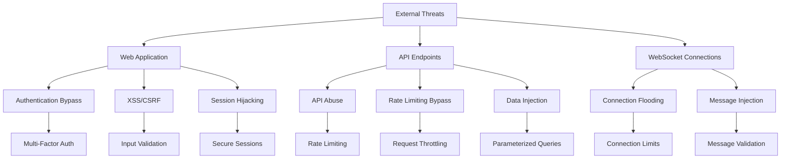

# EduAI Platform - Security Documentation

## Table of Contents
- [Security Overview](#security-overview)
- [Threat Model](#threat-model)
- [Authentication & Authorization](#authentication--authorization)
- [Data Protection](#data-protection)
- [Network Security](#network-security)
- [Application Security](#application-security)
- [Infrastructure Security](#infrastructure-security)
- [Compliance](#compliance)
- [Security Monitoring](#security-monitoring)
- [Incident Response](#incident-response)
- [Security Best Practices](#security-best-practices)
- [Security Checklist](#security-checklist)

---

## Security Overview

The EduAI Platform implements defense-in-depth security architecture with multiple layers of protection to ensure data confidentiality, integrity, and availability for all users.

### Security Principles

1. **Zero Trust Architecture** - Never trust, always verify
2. **Principle of Least Privilege** - Minimum necessary access
3. **Defense in Depth** - Multiple security layers
4. **Security by Design** - Built-in from the ground up
5. **Continuous Monitoring** - Real-time threat detection

### Security Layers

```
┌─────────────────────────────────────────────────────────┐
│                   Application Layer                      │
│  • Input Validation  • Rate Limiting  • RBAC            │
└─────────────────────────┬───────────────────────────────┘
                          │
┌─────────────────────────▼───────────────────────────────┐
│                    Service Layer                         │
│  • API Gateway      • JWT Auth     • Encryption        │
└─────────────────────────┬───────────────────────────────┘
                          │
┌─────────────────────────▼───────────────────────────────┐
│                   Network Layer                          │
│  • VPC Isolation   • Firewalls    • TLS Encryption     │
└─────────────────────────┬───────────────────────────────┘
                          │
┌─────────────────────────▼───────────────────────────────┐
│                 Infrastructure Layer                      │
│  • Container Security • IAM Roles   • Audit Logs       │
└─────────────────────────────────────────────────────────┘
```

---

## Threat Model

### Identified Threats

| Threat Category | Description | Mitigation |
|-----------------|-------------|------------|
| **Authentication Bypass** | Unauthorized access to user accounts | MFA, JWT with refresh tokens, account lockout |
| **Data Breach** | Unauthorized access to sensitive data | Encryption at rest/in transit, access controls |
| **DDoS Attacks** | Service disruption through traffic floods | Rate limiting, CDN protection, auto-scaling |
| **Injection Attacks** | SQL/NoSQL injection, XSS, CSRF | Input validation, parameterized queries |
| **Privilege Escalation** | Gaining higher access levels | RBAC, principle of least privilege |
| **Data Exfiltration** | Unauthorized data export | Data loss prevention, monitoring |
| **Supply Chain Attacks** | Compromised dependencies | Image scanning, dependency verification |

### Attack Surface Analysis



---

## Authentication & Authorization

### JWT Implementation

#### Token Structure
```json
{
  "header": {
    "alg": "RS256",
    "typ": "JWT",
    "kid": "key-id"
  },
  "payload": {
    "sub": "user-uuid",
    "email": "user@example.com",
    "role": "student",
    "tenant_id": "tenant-uuid",
    "iat": 1640995200,
    "exp": 1640995800,
    "jti": "token-uuid"
  }
}
```

#### Security Features
- **RS256** asymmetric encryption
- **Short-lived access tokens** (15 minutes)
- **Refresh tokens** with rotation (7 days)
- **Token blacklisting** on logout
- **Audience and issuer validation**

### Role-Based Access Control (RBAC)

#### Role Hierarchy
```yaml
roles:
  super_admin:
    permissions:
      - "*"
    inherits: []
  
  admin:
    permissions:
      - "users.*"
      - "courses.*"
      - "analytics.*"
      - "system.*"
    inherits: []
  
  instructor:
    permissions:
      - "courses.create"
      - "courses.update.own"
      - "courses.delete.own"
      - "enrollments.view.own"
      - "analytics.course.own"
    inherits: ["student"]
  
  student:
    permissions:
      - "courses.view"
      - "courses.enroll"
      - "profile.update.own"
      - "chat.send"
    inherits: []
```

#### Permission Checking
```typescript
// Middleware example
function requirePermission(permission: string) {
  return (req: Request, res: Response, next: NextFunction) => {
    const user = req.user;
    if (!hasPermission(user.role, permission)) {
      return res.status(403).json({
        error: 'INSUFFICIENT_PERMISSIONS',
        message: 'You do not have permission to perform this action'
      });
    }
    next();
  };
}

function hasPermission(role: string, permission: string): boolean {
  const roleConfig = ROLES[role];
  return roleConfig.permissions.includes('*') ||
         roleConfig.permissions.includes(permission) ||
         checkInheritedPermissions(role, permission);
}
```

### Multi-Factor Authentication (MFA)

#### Implementation
```typescript
interface MFAConfig {
  enabled: boolean;
  methods: ('totp' | 'sms' | 'email')[];
  required_for_roles: string[];
  backup_codes: number;
}

class MFAService {
  async generateTOTPSecret(userId: string): Promise<string> {
    const secret = speakeasy.generateSecret({
      name: `EduAI (${userId})`,
      issuer: 'EduAI Platform'
    });
    await this.storeUserSecret(userId, secret.base32);
    return secret.otpauth_url;
  }
  
  async verifyTOTPToken(userId: string, token: string): Promise<boolean> {
    const secret = await this.getUserSecret(userId);
    return speakeasy.totp.verify({
      secret,
      encoding: 'base32',
      token,
      window: 2
    });
  }
}
```

---

## Data Protection

### Encryption Standards

#### At Rest
- **Database**: AES-256 encryption
- **File Storage**: Server-side encryption
- **Backups**: Encrypted with customer-managed keys
- **Logs**: Sensitive data redaction

#### In Transit
- **TLS 1.3** for all external communications
- **mTLS** for service-to-service communication
- **WebSocket** secure connections (WSS)
- **Internal API** encryption

### Data Classification

```yaml
data_classification:
  public:
    - Course descriptions
    - Public user profiles
    - Marketing content
  
  internal:
    - User preferences
    - Course progress
    - Analytics data
  
  confidential:
    - Personal information
    - Payment information
    - Academic records
  
  restricted:
    - Authentication tokens
    - API keys
    - System credentials
```

### Privacy Controls

#### GDPR Compliance
```typescript
interface GDPRControls {
  consent: {
    marketing: boolean;
    analytics: boolean;
    cookies: boolean;
  };
  data_retention: {
    user_accounts: '365_days';
    course_progress: '7_years';
    chat_history: '90_days';
  };
  rights: {
    data_portability: boolean;
    right_to_erasure: boolean;
    access_requests: boolean;
  };
}

class PrivacyService {
  async exportUserData(userId: string): Promise<UserDataExport> {
    const userData = await this.collectUserData(userId);
    return {
      personal_info: this.sanitizePersonalInfo(userData.personal),
      course_data: userData.courses,
      analytics: this.aggregateAnalytics(userData.analytics),
      export_date: new Date().toISOString(),
      format: 'json'
    };
  }
  
  async deleteUserData(userId: string): Promise<void> {
    await this.softDeleteUser(userId);
    await this.schedulePermanentDeletion(userId, 30);
    await this.notifyDataProcessor(userId);
  }
}
```

---

## Network Security

### VPC Architecture

```yaml
vpc_configuration:
  cidr_block: "10.0.0.0/16"
  
  subnets:
    public:
      - cidr: "10.0.1.0/24"
        availability_zone: "us-east-1a"
        route_table: "public"
    
    private:
      - cidr: "10.0.2.0/24"
        availability_zone: "us-east-1a"
        route_table: "private"
      - cidr: "10.0.3.0/24"
        availability_zone: "us-east-1b"
        route_table: "private"
    
    database:
      - cidr: "10.0.4.0/24"
        availability_zone: "us-east-1a"
        route_table: "database"
  
  security_groups:
    web:
      ingress:
        - protocol: "tcp"
          port: 80
          source: "0.0.0.0/0"
        - protocol: "tcp"
          port: 443
          source: "0.0.0.0/0"
      egress:
        - protocol: "-1"
          destination: "0.0.0.0/0"
    
    application:
      ingress:
        - protocol: "tcp"
          port: 5000
          source: "sg-web"
        - protocol: "tcp"
          port: 8000
          source: "sg-web"
      egress:
        - protocol: "tcp"
          port: 5432
          destination: "sg-database"
        - protocol: "tcp"
          port: 6379
          destination: "sg-cache"
    
    database:
      ingress:
        - protocol: "tcp"
          port: 5432
          source: "sg-application"
      egress: []
```

### Firewall Rules

```yaml
firewall_rules:
  - name: "allow-http"
    protocol: "tcp"
    port: 80
    source: "0.0.0.0/0"
    action: "allow"
  
  - name: "allow-https"
    protocol: "tcp"
    port: 443
    source: "0.0.0.0/0"
    action: "allow"
  
  - name: "allow-ssh-admin"
    protocol: "tcp"
    port: 22
    source: "admin-office-ip"
    action: "allow"
  
  - name: "deny-all"
    protocol: "all"
    source: "0.0.0.0/0"
    action: "deny"
```

### DDoS Protection

```yaml
ddos_protection:
  cloudflare:
    enabled: true
    protection_level: "high"
    rate_limiting:
      requests_per_second: 100
      burst: 200
    
  application_level:
    rate_limiting:
      - endpoint: "/api/v1/auth/login"
        limit: 5
        window: "15m"
      - endpoint: "/api/v1/ai/chat"
        limit: 60
        window: "1m"
    
    ip_blocking:
      failed_attempts: 10
      time_window: "5m"
      block_duration: "1h"
```

---

## Application Security

### Input Validation

```typescript
// Validation middleware
import Joi from 'joi';

const userRegistrationSchema = Joi.object({
  email: Joi.string().email().required(),
  password: Joi.string()
    .min(8)
    .pattern(/^(?=.*[a-z])(?=.*[A-Z])(?=.*\d)(?=.*[@$!%*?&])[A-Za-z\d@$!%*?&]/)
    .required()
    .messages({
      'string.pattern.base': 'Password must contain at least one uppercase, one lowercase, one number, and one special character'
    }),
  first_name: Joi.string().min(2).max(50).required(),
  last_name: Joi.string().min(2).max(50).required(),
  role: Joi.string().valid('student', 'instructor').default('student')
});

function validateInput(schema: Joi.ObjectSchema) {
  return (req: Request, res: Response, next: NextFunction) => {
    const { error, value } = schema.validate(req.body);
    if (error) {
      return res.status(400).json({
        error: 'VALIDATION_ERROR',
        message: 'Invalid input data',
        details: error.details.map(detail => ({
          field: detail.path.join('.'),
          message: detail.message
        }))
      });
    }
    req.body = value;
    next();
  };
}
```

### XSS Protection

```typescript
// XSS prevention
import DOMPurify from 'dompurify';
import { JSDOM } from 'jsdom';

const window = new JSDOM('').window;
const purify = DOMPurify(window);

function sanitizeHtml(dirty: string): string {
  return purify.sanitize(dirty, {
    ALLOWED_TAGS: ['p', 'br', 'strong', 'em', 'ul', 'ol', 'li'],
    ALLOWED_ATTR: ['class'],
    KEEP_CONTENT: true
  });
}

// Content Security Policy
const cspHeaders = {
  'Content-Security-Policy': [
    "default-src 'self'",
    "script-src 'self' 'unsafe-inline' https://cdn.trusted.com",
    "style-src 'self' 'unsafe-inline'",
    "img-src 'self' data: https:",
    "connect-src 'self' https://api.eduai.com",
    "font-src 'self'",
    "object-src 'none'",
    "media-src 'self'",
    "frame-src 'none'"
  ].join('; ')
};
```

### CSRF Protection

```typescript
// CSRF token implementation
import crypto from 'crypto';

class CSRFProtection {
  generateToken(): string {
    return crypto.randomBytes(32).toString('hex');
  }
  
  validateToken(token: string, sessionToken: string): boolean {
    return crypto.timingSafeEqual(
      Buffer.from(token, 'hex'),
      Buffer.from(sessionToken, 'hex')
    );
  }
  
  middleware() {
    return (req: Request, res: Response, next: NextFunction) => {
      if (['POST', 'PUT', 'DELETE'].includes(req.method)) {
        const token = req.headers['x-csrf-token'] as string;
        const sessionToken = req.session.csrfToken;
        
        if (!token || !sessionToken || !this.validateToken(token, sessionToken)) {
          return res.status(403).json({
            error: 'CSRF_TOKEN_INVALID',
            message: 'CSRF token validation failed'
          });
        }
      }
      next();
    };
  }
}
```

### SQL Injection Prevention

```typescript
// Parameterized queries
class UserRepository {
  async findByEmail(email: string): Promise<User | null> {
    const query = 'SELECT * FROM users WHERE email = $1 AND is_active = true';
    const result = await this.pool.query(query, [email]);
    return result.rows[0] || null;
  }
  
  async create(userData: CreateUserDto): Promise<User> {
    const query = `
      INSERT INTO users (email, password_hash, first_name, last_name, role, tenant_id)
      VALUES ($1, $2, $3, $4, $5, $6)
      RETURNING *
    `;
    const values = [
      userData.email,
      userData.passwordHash,
      userData.firstName,
      userData.lastName,
      userData.role,
      userData.tenantId
    ];
    const result = await this.pool.query(query, values);
    return result.rows[0];
  }
}
```

---

## Infrastructure Security

### Container Security

#### Dockerfile Security
```dockerfile
# Multi-stage build with minimal base image
FROM node:20-alpine AS builder
WORKDIR /app
COPY package*.json ./
RUN npm ci --only=production && npm cache clean --force

FROM node:20-alpine AS runtime
# Create non-root user
RUN addgroup -g 1001 -S nodejs && \
    adduser -S nextjs -u 1001
WORKDIR /app
COPY --from=builder /app/node_modules ./node_modules
COPY --chown=nextjs:nodejs . .
USER nextjs
EXPOSE 3000
# Read-only filesystem
CMD ["node", "server.js"]
```

#### Pod Security Policy
```yaml
apiVersion: policy/v1beta1
kind: PodSecurityPolicy
metadata:
  name: eduai-psp
spec:
  privileged: false
  allowPrivilegeEscalation: false
  requiredDropCapabilities:
    - ALL
  volumes:
    - 'configMap'
    - 'emptyDir'
    - 'projected'
    - 'secret'
    - 'downwardAPI'
    - 'persistentVolumeClaim'
  runAsUser:
    rule: 'MustRunAsNonRoot'
  seLinux:
    rule: 'RunAsAny'
  fsGroup:
    rule: 'RunAsAny'
  readOnlyRootFilesystem: true
```

### Secret Management

#### Kubernetes Secrets
```yaml
apiVersion: v1
kind: Secret
metadata:
  name: eduai-secrets
  namespace: eduai-production
type: Opaque
data:
  db-password: <base64-encoded-password>
  jwt-secret: <base64-encoded-jwt-secret>
  redis-password: <base64-encoded-redis-password>
  openai-api-key: <base64-encoded-api-key>
---
apiVersion: v1
kind: Secret
metadata:
  name: eduai-tls
  namespace: eduai-production
type: kubernetes.io/tls
data:
  tls.crt: <base64-encoded-certificate>
  tls.key: <base64-encoded-private-key>
```

#### External Secret Management
```yaml
# HashiCorp Vault integration
apiVersion: v1
kind: Secret
metadata:
  name: vault-token
  annotations:
    vault.hashicorp.com/agent-inject: "true"
    vault.hashicorp.com/role: "eduai"
    vault.hashicorp.com/template: |
      {{- with secret "secret/data/eduai" -}}
      db_password: "{{ .Data.data.db_password }}"
      jwt_secret: "{{ .Data.data.jwt_secret }}"
      {{- end }}
type: Opaque
```

### Image Security

#### Trivy Scanning
```yaml
# .github/workflows/security-scan.yml
name: Security Scan
on: [push, pull_request]

jobs:
  security-scan:
    runs-on: ubuntu-latest
    steps:
      - uses: actions/checkout@v3
      
      - name: Run Trivy vulnerability scanner
        uses: aquasecurity/trivy-action@master
        with:
          image-ref: 'eduai-backend:latest'
          format: 'sarif'
          output: 'trivy-results.sarif'
      
      - name: Upload Trivy scan results
        uses: github/codeql-action/upload-sarif@v2
        with:
          sarif_file: 'trivy-results.sarif'
```

---

## Compliance

### SOC 2 Type II Compliance

#### Security Controls
```yaml
soc2_controls:
  security:
    - access_control: "Multi-factor authentication required for admin access"
    - encryption: "All data encrypted at rest and in transit"
    - monitoring: "24/7 security monitoring and alerting"
    - incident_response: "Defined incident response procedures"
  
  availability:
    - uptime_sla: "99.9% uptime guarantee"
    - backup: "Daily automated backups with 30-day retention"
    - disaster_recovery: "RTO < 4 hours, RPO < 1 hour"
    - monitoring: "Real-time performance monitoring"
  
  processing_integrity:
    - data_validation: "Input validation and sanitization"
    - audit_logging: "Comprehensive audit trails"
    - change_management: "Formal change management process"
    - testing: "Regular security and performance testing"
  
  confidentiality:
    - data_classification: "Formal data classification program"
    - access_controls: "Role-based access controls"
    - data_minimization: "Collect only necessary data"
    - privacy_controls: "GDPR-compliant privacy controls"
```

### GDPR Compliance

#### Data Processing Records
```typescript
interface DataProcessingRecord {
  purpose: string;
  legal_basis: 'consent' | 'contract' | 'legal_obligation' | 'vital_interests' | 'public_task' | 'legitimate_interests';
  categories_of_data_subjects: string[];
  categories_of_personal_data: string[];
  recipients: string[];
  retention_period: string;
  security_measures: string[];
  international_transfers: boolean;
  third_country: string;
  appropriate_safeguards: string[];
}

class GDPRCompliance {
  private processingRecords: Map<string, DataProcessingRecord> = new Map();
  
  createProcessingRecord(record: DataProcessingRecord): void {
    this.processingRecords.set(record.purpose, record);
  }
  
  checkDataMinimization(dataCollected: string[], purpose: string): boolean {
    const record = this.processingRecords.get(purpose);
    return record?.categories_of_personal_data.every(
      category => dataCollected.includes(category)
    ) || false;
  }
  
  generatePrivacyPolicy(): string {
    return `
      Privacy Policy - EduAI Platform
      
      1. Data Collection
      We collect personal information necessary for providing educational services.
      
      2. Legal Basis
      Processing is based on consent and contractual necessity.
      
      3. Data Rights
      You have the right to access, rectify, erase, and port your data.
      
      4. Data Retention
      Data is retained only as long as necessary for the stated purposes.
      
      5. International Transfers
      Data is processed within secure EU/US facilities with appropriate safeguards.
    `;
  }
}
```

---

## Security Monitoring

### Real-time Monitoring

```yaml
monitoring:
  security_events:
    - failed_login_attempts
    - privilege_escalation
    - data_access_anomalies
    - unusual_api_usage
    - network_intrusions
  
  metrics:
    - authentication_failures_per_minute
    - privileged_operations_per_hour
    - data_export_volume
    - api_request_anomalies
    - network_traffic_patterns
  
  alerts:
    critical:
      - multiple_failed_logins
      - admin_account_compromise
      - data_breach_detected
      - unauthorized_data_access
    
    warning:
      - unusual_login_patterns
      - elevated_api_usage
      - permission_changes
      - configuration_modifications
```

### Security Dashboard

```typescript
interface SecurityMetrics {
  authentication: {
    successful_logins: number;
    failed_logins: number;
    mfa_usage_rate: number;
    active_sessions: number;
  };
  authorization: {
    privilege_escalation_attempts: number;
    permission_denials: number;
    admin_actions: number;
  };
  data_protection: {
    data_access_requests: number;
    data_exports: number;
    encryption_failures: number;
    backup_status: 'healthy' | 'warning' | 'critical';
  };
  network_security: {
    ddos_attacks_blocked: number;
    suspicious_ips_blocked: number;
    ssl_certificate_expiry: number;
  };
}

class SecurityMonitoringService {
  async generateSecurityReport(): Promise<SecurityReport> {
    const metrics = await this.collectSecurityMetrics();
    const threats = await this.identifyThreats();
    const recommendations = await this.generateRecommendations(metrics, threats);
    
    return {
      timestamp: new Date().toISOString(),
      metrics,
      threats,
      recommendations,
      risk_score: this.calculateRiskScore(metrics, threats)
    };
  }
}
```

---

## Incident Response

### Incident Response Plan

```yaml
incident_response:
  phases:
    preparation:
      - establish_incident_response_team
      - define communication channels
      - create documentation
      - conduct regular training
    
    detection:
      - automated monitoring alerts
      - manual security reviews
      - user reports
      - third-party notifications
    
    analysis:
      - determine scope and impact
      - identify root cause
      - assess data exposure
      - document findings
    
    containment:
      - isolate affected systems
      - block malicious activity
      - preserve evidence
      - notify stakeholders
    
    eradication:
      - remove malicious code
      - patch vulnerabilities
      - update security controls
      - verify system integrity
    
    recovery:
      - restore from backups
      - validate functionality
      - monitor for recurrence
      - document lessons learned
    
    post_incident:
      - conduct post-mortem
      - update procedures
      - improve monitoring
      - share findings
  
  severity_levels:
    critical:
      response_time: "15 minutes"
      escalation: "immediate"
      communication: "all stakeholders"
    
    high:
      response_time: "1 hour"
      escalation: "within 30 minutes"
      communication: "management and affected users"
    
    medium:
      response_time: "4 hours"
      escalation: "within 2 hours"
      communication: "relevant teams"
    
    low:
      response_time: "24 hours"
      escalation: "as needed"
      communication: "internal documentation"
```

### Incident Response Playbook

```typescript
interface Incident {
  id: string;
  severity: 'critical' | 'high' | 'medium' | 'low';
  type: 'data_breach' | 'security_incident' | 'service_disruption' | 'compliance_violation';
  description: string;
  affected_systems: string[];
  timeline: IncidentEvent[];
  actions: IncidentAction[];
  status: 'open' | 'investigating' | 'contained' | 'resolved' | 'closed';
}

class IncidentResponseService {
  async createIncident(incidentData: CreateIncidentDto): Promise<Incident> {
    const incident: Incident = {
      id: generateUUID(),
      severity: incidentData.severity,
      type: incidentData.type,
      description: incidentData.description,
      affected_systems: incidentData.affectedSystems,
      timeline: [{
        timestamp: new Date(),
        event: 'Incident created',
        details: incidentData.description
      }],
      actions: [],
      status: 'open'
    };
    
    await this.notifyIncidentResponseTeam(incident);
    await this.createCommunicationChannel(incident);
    await this.initializeDocumentation(incident);
    
    return incident;
  }
  
  async escalateIncident(incidentId: string, reason: string): Promise<void> {
    const incident = await this.getIncident(incidentId);
    await this.notifyManagement(incident, reason);
    await this.updateSeverity(incidentId, 'critical');
    await this.initiateEmergencyProcedures(incident);
  }
}
```

---

## Security Best Practices

### Development Security

#### Secure Coding Guidelines
```typescript
// 1. Input Validation
function validateInput(input: unknown, schema: Joi.Schema): void {
  const { error } = schema.validate(input);
  if (error) {
    throw new ValidationError(error.details);
  }
}

// 2. Error Handling
function handleError(error: unknown, context: string): void {
  const sanitizedError = sanitizeError(error);
  logger.error(`Error in ${context}`, sanitizedError);
  // Never expose internal errors to users
}

// 3. Secure Defaults
const secureConfig = {
  sessionTimeout: 15 * 60 * 1000, // 15 minutes
  maxLoginAttempts: 5,
  lockoutDuration: 15 * 60 * 1000, // 15 minutes
  passwordMinLength: 12,
  requireMFA: true
};

// 4. Least Privilege
function checkPermission(user: User, resource: string, action: string): boolean {
  return user.permissions.some(
    permission => permission.resource === resource && 
                  permission.actions.includes(action)
  );
}
```

#### Dependency Security
```json
{
  "scripts": {
    "security-audit": "npm audit --audit-level moderate",
    "dependency-check": "npm-check-updates",
    "license-check": "license-checker --onlyAllow 'MIT;Apache-2.0;BSD-2-Clause;BSD-3-Clause'",
    "snyk-test": "snyk test"
  },
  "devDependencies": {
    "npm-audit-resolver": "^2.0.0",
    "snyk": "^1.1000.0",
    "license-checker": "^25.0.1"
  }
}
```

### Operational Security

#### Access Management
```yaml
access_management:
  principle_of_least_privilege:
    description: "Users only have access to resources needed for their role"
    implementation: "RBAC with granular permissions"
  
  separation_of_duties:
    description: "Critical functions require multiple people"
    implementation: "MFA for admin actions, approval workflows"
  
  regular_access_reviews:
    description: "Periodic review of user permissions"
    implementation: "Quarterly access audits"
  
  emergency_access:
    description: "Break-glass access for emergencies"
    implementation: "Time-limited elevated access with audit trail"
```

#### Backup Security
```typescript
interface BackupConfig {
  encryption: {
    enabled: boolean;
    algorithm: 'AES-256-GCM';
    key_rotation_days: number;
  };
  retention: {
    daily: number;
    weekly: number;
    monthly: number;
    yearly: number;
  };
  testing: {
    frequency: 'weekly' | 'monthly';
    restore_test: boolean;
    integrity_check: boolean;
  };
}

class BackupService {
  async createEncryptedBackup(data: Buffer): Promise<EncryptedBackup> {
    const key = await this.generateEncryptionKey();
    const iv = crypto.randomBytes(16);
    const cipher = crypto.createCipher('aes-256-gcm', key);
    
    const encrypted = Buffer.concat([
      cipher.update(data),
      cipher.final()
    ]);
    
    const authTag = cipher.getAuthTag();
    
    return {
      data: encrypted,
      iv,
      authTag,
      keyId: await this.storeKey(key)
    };
  }
}
```

---

## Security Checklist

### Pre-Deployment Checklist

```markdown
- [ ] All secrets are stored in secure vault
- [ ] SSL/TLS certificates are valid and renewed
- [ ] Security headers are properly configured
- [ ] Input validation is implemented for all endpoints
- [ ] Rate limiting is configured for all APIs
- [ ] Database connections use parameterized queries
- [ ] Container images are scanned for vulnerabilities
- [ ] RBAC permissions are reviewed and minimized
- [ ] Audit logging is enabled for sensitive operations
- [ ] Backup and recovery procedures are tested
- [ ] Monitoring and alerting are configured
- [ ] Incident response team is notified of deployment
```

### Ongoing Security Checklist

```markdown
- [ ] Security patches are applied within 30 days
- [ ] Access reviews are performed quarterly
- [ ] Security training is conducted annually
- [ ] Penetration tests are performed semi-annually
- [ ] Backup integrity is verified weekly
- [ ] Security monitoring is reviewed daily
- [ ] Incident response procedures are updated
- [ ] Compliance requirements are reviewed
- [ ] Third-party dependencies are audited monthly
- [ ] Security documentation is kept current
```

### Incident Response Checklist

```markdown
- [ ] Incident is properly classified and prioritized
- [ ] Incident response team is assembled
- [ ] Containment measures are implemented
- [ ] Evidence is preserved for investigation
- [ ] Stakeholders are notified appropriately
- [ ] Root cause analysis is completed
- [ ] Remediation actions are implemented
- [ ] Post-incident review is conducted
- [ ] Lessons learned are documented
- [ ] Security controls are updated
```

---

This security documentation provides comprehensive guidance for maintaining the security posture of the EduAI Platform, ensuring protection against modern threats while maintaining compliance with industry standards.
